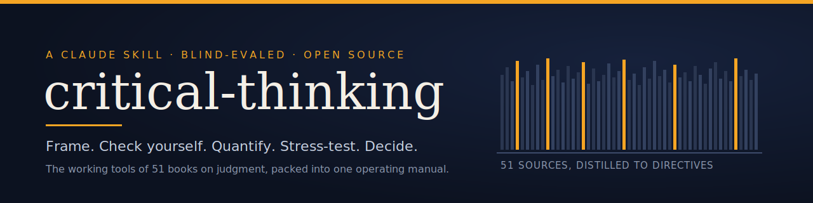
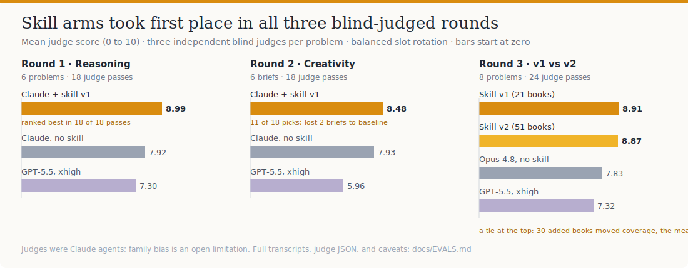
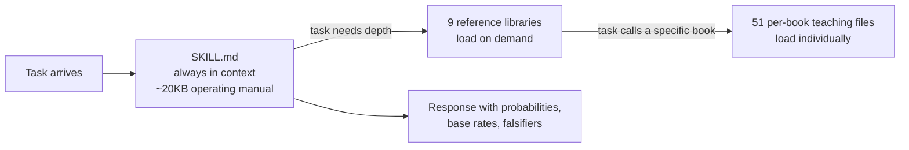

<div align="center">



# critical-thinking

**A Claude Code skill distilled from 51 books on judgment, blind-evaled against GPT-5.5, with the full eval harness and every transcript that shaped it.**

[](LICENSE)
[](#the-library)
[](#how-it-works)
[](evals/)
[](CONTRIBUTING.md)

[Install](#install) · [What it does](#what-it-does) · [Results](#the-numbers) · [How it works](#how-it-works) · [The story](#the-story-including-the-failures) · [Contributing](CONTRIBUTING.md)

<sub>v2.0.0 · last updated June 2026 · [changelog](CHANGELOG.md)</sub>

</div>

---

**critical-thinking** is an open-source [Agent Skill](https://docs.claude.com/en/docs/agents-and-tools/agent-skills) for Claude Code and Claude-based agents that makes Claude reason with explicit probabilities, base rates, and falsifiers: in blind evaluations it ranked first in 18 of 18 judge passes against baseline Claude and GPT-5.5. Frontier models already know the literature of good judgment from pretraining. Left to their defaults, they hedge in prose: "this could be confounding, or reverse causation, and the evidence is uncertain." This skill converts that latent knowledge into executed behavior. With it loaded, Claude states calibrated probabilities, anchors on base rates before vivid specifics, attaches a falsifier to every verdict, names its own cognitive traps while reasoning, and runs premortems on its own recommendations.

The repo ships three things most skill repos leave out: the **full eval harness** (blind, multi-arm, balanced-rotation, LLM-judged), **every raw transcript and judge file** from five eval rounds, and the **hypotheses that broke** along the way. The honest parts are the useful parts. The newest round ([round 5](evals/round-5-telemetry-index/)) benchmarks the skill against 14 alternatives, including free prompt techniques, and prices each one in tokens.

**At a glance**

| | |
|---|---|
| What | An Agent Skill: one operating manual (SKILL.md) + 9 reference libraries + 51 book teaching files, all markdown |
| Headline result | 8.99 vs 7.92 (Claude baseline) vs 7.30 (GPT-5.5 xhigh) mean judge score; best in 18/18 blind passes. In the 19-condition round 5: #3 of 19 on judged quality (a top-cluster near-tie), #1 of 19 on objective rigor |
| Evidence | 5 eval rounds with full transcripts and judge JSON in [evals/](evals/) |
| Install | Copy one folder into `~/.claude/skills/`; no build, no dependencies, no API keys |
| License | MIT |

<div align="center">

</div>

## What it does

The same problem, answered by the same model on the same day. Round 1, problem 0: an observational study (n=8,000, p<0.01) links coffee to lower depression, and a wellness brand cites it to sell extract supplements. Should you believe coffee reduces depression?

<table>
<tr>
<th width="50%">Claude, no skill (judged 8.40)</th>
<th width="50%">Claude + skill (judged 9.47, all 3 judges' best pick)</th>
</tr>
<tr>
<td valign="top">

> This is a single observational, likely cross-sectional association. It is consistent with a real effect, with confounding, and with reverse causation, and it cannot distinguish among them. It is a reasonable prompt for a trial, not evidence that coffee treats depression.

</td>
<td valign="top">

> A reasonable outside-view prior: a fresh single observational diet-mood association reflects a real, sizable causal effect in the claimed direction maybe 15 to 25 percent of the time. [...] I put **roughly 20 to 25 percent** that coffee causally and meaningfully reduces depression risk in adults. I put that the *supplement* delivers a worthwhile antidepressant effect far lower, **under 10 percent**.

</td>
</tr>
</table>

Both answers are correct. The left one hedges in words; the right one prices its beliefs, and earlier in the same response it grounds the prior in the vitamin E / beta-carotene / HRT replication graveyard and names the study design (Mendelian randomization) that would change its mind. A judge, blind to which arm was which:

> "...uniquely supplies an outside-view base rate (the vitamin E / beta-carotene / HRT reversal graveyard) with explicit probabilities (~20-25% causal, <10% supplement, 75-80% claim overstated) plus a Mendelian-randomization falsifier"

## Install

The skill is a folder of markdown. No build, no dependencies.

**Claude Code (macOS / Linux):**

```bash
git clone https://github.com/Johna2an/critical-thinking.git
cp -r critical-thinking/skill ~/.claude/skills/critical-thinking
```

**Claude Code (Windows, PowerShell):**

```powershell
git clone https://github.com/Johna2an/critical-thinking.git
Copy-Item -Recurse critical-thinking\skill "$env:USERPROFILE\.claude\skills\critical-thinking"
```

That's it. The skill self-triggers on reasoning-shaped requests ("is this true", "what are the odds", "red-team this", "find the flaw", "should I", "brainstorm", "what could blindside us"), and you can invoke it explicitly by asking Claude to use the critical-thinking skill. Any agent stack that supports the [Agent Skills](https://docs.claude.com/en/docs/agents-and-tools/agent-skills) format (`SKILL.md` + `references/`) can load it the same way.

## The numbers

Five rounds, every arm blind-judged on anonymized responses, three independent judges per problem, balanced slot rotation. Full data, per-problem tables, and judge quotes: [docs/EVALS.md](docs/EVALS.md). Raw material: [evals/](evals/).

The headline result, in one quotable sentence: in a blind evaluation with three independent judges per problem, Claude with the critical-thinking skill scored 8.99 out of 10 across six reasoning problems, against 7.92 for Claude without the skill and 7.30 for GPT-5.5 at maximum reasoning effort, ranking first in 18 of 18 judge passes.

That was a three-arm test. [Round 5](evals/round-5-telemetry-index/) ran the hard version: 19 conditions, including every credible public rival skill and the free prompt techniques anyone can type, each one priced in tokens. The skill stays in the top quality cluster and leads the entire field on objective rigor. A field that now includes a one-line `self-critique` prompt is a near-tie at the top, and this skill is the most expensive condition to run. We publish that result in full, because a skill about calibration that hid its own benchmark would be a contradiction. The honest detail is below.

| Round | Question asked | Result |
|---|---|---|
| **1 · Reasoning** (6 problems) | Does the skill change reasoning at all? | **Skill 8.99** vs base 7.92 vs GPT-5.5 7.30. Skill ranked best in **18 of 18** judge passes. Biggest gap: calibration, +1.73. |
| **2 · Creativity** (6 briefs) | Does it help divergent work too? | **Skill 8.48** vs base 7.93 vs GPT-5.5 5.96, and the win was partial: 11/18 picks, with baseline sweeping 2 of 6 briefs. The scaffold raises the floor and can cap the ceiling. |
| **3 · v1 vs v2** (8 problems) | Do 30 more books help? | **v1 8.91 vs v2 8.87**: a tie at the top. v2 took the most judge best-picks on the three problems where its new material supplied the winning move; v1 kept the four problems judges decided on explicit probabilities. The first 21 books had captured nearly all the headroom. |
| **4 · vs rival skills** (12 problems) | How does it do against other skills, not just baseline? | Ours led reasoning **8.70**, ahead of cc-thinking, wanikua, and baseline; creativity a near-tie. [round-4](evals/round-4-vs-competitors/) |
| **5 · full field + cost** (19 conditions) | Against every rival skill and free prompt techniques, priced in tokens? | **#3 of 19 on judged quality** (kdense 8.13, self-critique 8.10, **ours 8.03**), a top-cluster near-tie, and **#1 of 19 on objective rigor**. Also the heaviest context-load in the field. [round-5](evals/round-5-telemetry-index/) |

### Round 5: the full field, priced (V2)

<div align="center">

</div>

Widening the field from three arms to fifteen, and counting the tokens, surfaced three things the narrow rounds could not:

- **The cheapest interventions sit right at the top.** A free one-line `self-critique` prompt (8.10) and `plain chain-of-thought` (8.00) land in the top cluster with the best skills; only one focused rival, K-Dense's scientific-critical-thinking (8.13), edges them. Expensive structure helps about as much as cheap structure.
- **Where this skill stands alone is objective rigor.** It is **#1 of 19** on the deterministic markers, and its falsifier presence (5.0 vs 2.5 or less for everything else) is the one length-independent place no other condition reaches: it reliably names what would change its mind.
- **It is the most expensive condition to run** (about 14k tokens of context load), so lighter options that score as well dominate it on the quality-vs-cost frontier.

That feedback is the V2 work list: trim the context tax, keep the falsifier discipline, and fold a self-critique pass into the skill itself. The cheapest thing on the board is also the best, so the skill should simply absorb it.

The rest of the picture, all from the same run:

<div align="center">

**Judged reasoning quality, 19 conditions** (ours #3, a top-cluster near-tie)


**Objective rigor markers** (ours #1, falsifier presence double the next best)


**Cost to operate** (the context tax, not the answer, is the cost)


**Value: judged quality per 1,000 tokens** (the cheap options win; ours near the bottom)


</div>

Full interactive three-track dashboard, both token and USD cost frontiers, all 19 conditions, and the raw data: **[evals/round-5-telemetry-index/](evals/round-5-telemetry-index/)**.

## How it works



Three layers of progressive disclosure:

1. **`SKILL.md`**, the operating manual, is the only layer guaranteed to be in context. Eight phases that mirror how a hard problem unfolds (frame, check yourself, argue cleanly, quantify, stress-test, think in systems, generate alternatives, decide), a NEVER list of 18 named failure modes, and the section we consider the design's core: **"When the directives collide"**, ten scoping rules for cases where two valid directives point opposite ways (trust intuition or distrust it; quantify or stay humble at the tail; generate wide or converge).
2. **9 reference libraries** (`references/*.md`): biases, argument and evidence, forecasting and decisions, creativity, systems and complexity, uncertainty and risk, formal models, epistemology, plus the original v1 combined systems-science-and-creativity library. Loaded only when the task needs that depth.
3. **51 per-book teaching files** (`references/books/`), each restating one book's working tools as directives an agent can execute. Loaded individually, rarely.

The eval data says the manual does most of the work and the library is the long tail; see hypothesis H4 in [docs/HYPOTHESES.md](docs/HYPOTHESES.md).

## The story, including the failures

The project ran as a sequence of falsifiable bets. Short version here, full version in [docs/HYPOTHESES.md](docs/HYPOTHESES.md) and [docs/PROCESS.md](docs/PROCESS.md).

**Bet 1: distillation changes behavior.** Held, strongly. 21 books were each distilled by a dedicated agent into executable directives, synthesized into a [master outline](docs/master-synthesis.md) (10 points where independent authors converge, 5 tensions resolved by scoping), then compressed into v1. Round 1: +1.07 over baseline, 18/18 judge sweeps, and judges named the same mechanisms every time: explicit numbers, outside-view base rates, falsifiers, self-named traps.

**Bet 2: one manual fits all thinking.** Broke. Round 2 was designed to hunt the weak flank and found it: on divergent-thinking briefs the skill won 11/18 against baseline's 7, losing the two most-rehearsed briefs ("reinvent the chair", "reinvent the report card") 3-0. Judges praised the losing skill responses as "rigorously developed" and "systematically spread", which is the vocabulary of second place, while the unscaffolded baseline produced "the single strangest swing... that still coheres". On rehearsed creative ground, systematic method walks into the same trope basins; the wild coherent outlier wins.

**Bet 3: more books, better skill.** Broke on the mean, held on coverage. v2 grew the library from 21 to 51 books (9 libraries, a rebuilt generation phase). Round 3 verdict: 8.91 vs 8.87, a statistical tie, with the win profile shifted exactly to where the new books live and away from the calibration habit that scores highest everywhere. Average response length was identical (914 vs 916 words), so the cost was displaced emphasis rather than bloat. The design lesson, now a contribution rule: **enforcing core moves beats enlarging the library.**

**Bet 4: the skill beats the field, and the cost is worth it.** Broke into a near-tie, and the cost lost. [Round 5](evals/round-5-telemetry-index/) widened the field to 19 conditions (every credible public rival skill plus the free prompt techniques anyone can type) and priced each in tokens. The skill landed #3 of 19 on judged quality, inside a top cluster where a focused rival skill and a free one-line self-critique prompt narrowly scored higher, and it was the most expensive condition to run by a wide margin. It did keep one thing no other condition reached: #1 on objective rigor, with a falsifier-presence score double the next best. The lesson, now driving V2: cheap structure rivals expensive structure on judged quality, so the skill should absorb a self-critique pass and shed its context-tax rather than out-build the field.

## What's in the repo

```
critical-thinking/
├── skill/                  # the installable skill: SKILL.md + references/ (v2, current)
├── versions/v1/            # frozen v1 (21 books), kept for reproducible A/B evals
├── evals/
│   ├── harness/            # setup, blinding, judging aggregation, report scripts
│   ├── round-1-reasoning/  # all responses, judge JSON, verdicts, HTML report
│   ├── round-2-creativity/
│   ├── round-3-v1-vs-v2/
│   ├── round-4-vs-competitors/      # vs two rival skills + baseline
│   └── round-5-telemetry-index/     # 19-condition field + cost; dashboard + banners
├── docs/
│   ├── EVALS.md            # full results + honest limitations
│   ├── HYPOTHESES.md       # the bets, what held, what broke, why
│   ├── PROCESS.md          # the build pipeline, end to end
│   ├── ROADMAP.md          # ten open problems, ordered by value
│   └── master-synthesis.md # the architect's blueprint from the 21-book corpus
└── assets/                 # banner, results chart (SVG)
```

Each eval round folder is self-auditing: open `_report.html` in a browser for side-by-side responses with scores, or recompute the tables yourself from the raw judge JSON and rotation maps (the aggregators are deterministic).

## Limitations, before you quote the numbers

1. **Claude judged Claude.** All judges were Claude agents; family self-preference is a documented LLM-as-judge bias. Blind rotation cancels position bias, family bias survives it. Re-judging the included blinded transcripts with another model family is the [top item on the roadmap](docs/ROADMAP.md).
2. **n=1 per arm per problem.** Large effects (Round 1) survive that; the 0.04 v1-v2 gap does not.
3. **Authored problems.** The problem sets were written by the project. Adversarial, held-out problem sets are wanted.

Full list in [docs/EVALS.md](docs/EVALS.md#limitations-read-before-citing-these-numbers).

## Contributing

The contribution rule follows from the project's own history: claims ride on evals. State the hypothesis, run the relevant round before and after, ship the diff with the data. The seven highest-value open problems, from independent re-judging to a v3 that enforces calibration as a hard rule, are tabulated in [CONTRIBUTING.md](CONTRIBUTING.md) and [docs/ROADMAP.md](docs/ROADMAP.md).

## The library

<details>
<summary><b>The original 21 (v1): judgment, argument, statistics, forecasting</b></summary>

| Book | Author(s) |
|---|---|
| [Thinking, Fast and Slow](https://en.wikipedia.org/wiki/Thinking,_Fast_and_Slow) | Kahneman |
| [The Scout Mindset](https://en.wikipedia.org/wiki/The_Scout_Mindset) | Galef |
| [Superforecasting](https://en.wikipedia.org/wiki/Superforecasting) | Tetlock & Gardner |
| [The Signal and the Noise](https://en.wikipedia.org/wiki/The_Signal_and_the_Noise) | Silver |
| Thinking in Bets | Duke |
| Asking the Right Questions | Browne & Keeley |
| A Rulebook for Arguments | Weston |
| Thinking from A to Z | Warburton |
| [How to Lie with Statistics](https://en.wikipedia.org/wiki/How_to_Lie_with_Statistics) | Huff |
| [Calling Bullshit](https://en.wikipedia.org/wiki/Calling_Bullshit) | Bergstrom & West |
| Thinking in Systems | Meadows |
| [The Demon-Haunted World](https://en.wikipedia.org/wiki/The_Demon-Haunted_World) | Sagan |
| [The Beginning of Infinity](https://en.wikipedia.org/wiki/The_Beginning_of_Infinity) | Deutsch |
| Nonsense on Stilts | Pigliucci |
| Lateral Thinking | de Bono |
| [Intuition Pumps](https://en.wikipedia.org/wiki/Intuition_Pumps_and_Other_Tools_for_Thinking) | Dennett |
| [Factfulness](https://en.wikipedia.org/wiki/Factfulness) | Rosling |
| Rational Choice in an Uncertain World | Hastie & Dawes |
| Judgment in Managerial Decision Making | Bazerman & Moore |
| [How to Read a Book](https://en.wikipedia.org/wiki/How_to_Read_a_Book) | Adler & Van Doren |
| The Art of Doing Science and Engineering | Hamming |

</details>

<details>
<summary><b>Added in v2: creativity and the cognitive engine of ideas (15)</b></summary>

The Act of Creation (Koestler) · Six Thinking Hats (de Bono) · A Whack on the Side of the Head (von Oech) · Where Good Ideas Come From (Johnson) · Change by Design (Brown) · Creative Confidence (Kelley & Kelley) · The Creative Habit (Tharp) · The Creative Act (Rubin) · Lessons in Creativity · Designing Your Life (Burnett & Evans) · The Design of Everyday Things (Norman) · Surfaces and Essences (Hofstadter & Sander) · Gödel, Escher, Bach (Hofstadter) · The Mind's I (Hofstadter & Dennett) · The Society of Mind (Minsky)

</details>

<details>
<summary><b>Added in v2: systems, risk, models, epistemology (15)</b></summary>

**Systems:** Seeing Like a State (Scott) · Systemantics (Gall) · The Fifth Discipline (Senge) · The Death and Life of Great American Cities (Jacobs)

**Uncertainty and risk:** Antifragile, The Black Swan, Fooled by Randomness (Taleb)

**Models and strategy:** The Model Thinker (Page) · An Introduction to Statistical Learning (James, Witten, Hastie, Tibshirani) · Models of My Life (Simon) · The Art of Strategy (Dixit & Nalebuff)

**Epistemology:** The Structure of Scientific Revolutions (Kuhn) · The Logic of Scientific Discovery (Popper) · Against Method (Feyerabend) · What is this thing called Knowledge? (Pritchard)

</details>

The reference files are original prose: each book's ideas and methods restated as directives, written from scratch, with no reproduced text. Raw book text never enters this repo. If you are an author or publisher with a concern about a teaching file, open an issue and we will address it directly.

## FAQ

**What is the critical-thinking skill?**
An open-source Agent Skill for Claude Code: a folder of markdown (an operating manual plus reference libraries) that loads into Claude's context and changes how it reasons. It was distilled from 51 books on judgment, decision-making, forecasting, systems thinking, creativity, and the philosophy of science.

**How is this different from telling Claude to "think carefully"?**
The skill replaces vague instruction with named, executable moves: state a calibrated probability, anchor on a base rate before case specifics, attach a falsifier to every verdict, run a premortem. In blind evals, those specific behaviors produced the entire scoring gap over a "reason carefully" baseline prompt that both arms shared.

**How much does it improve Claude's reasoning?**
On a 6-problem reasoning battery scored 0 to 10 by three blind judges per problem, Claude with the skill scored 8.99 against 7.92 without it and 7.30 for GPT-5.5 at xhigh reasoning effort, taking first place in 18 of 18 judge passes. Read [docs/EVALS.md](docs/EVALS.md) for the limitations before quoting these numbers, starting with the fact that the judges were Claude agents.

**Does it work with ChatGPT, GPT, Gemini, or local models?**
Untested, and testing it is [roadmap item 3](docs/ROADMAP.md). SKILL.md is plain markdown with no Claude-specific machinery, so it can be pasted into any system prompt. If the behavioral shifts transfer, this becomes a portable reasoning protocol; results from other models are a welcome contribution.

**Is it free?**
Yes. MIT license, no build step, no dependencies, no API keys. Copy one folder into `~/.claude/skills/`.

**Where does the skill's knowledge come from? Is book text included?**
Every reference file is original prose: each book's methods restated as directives, written from scratch. The repo distributes no book text, and raw sources are excluded by `.gitignore` pattern.

**Can I add a book or change a directive?**
Yes, and the bar is empirical: state the hypothesis, run the relevant eval round before and after, ship the diff with the data. [CONTRIBUTING.md](CONTRIBUTING.md) has the loop, plus the seven open problems where help is most wanted.

## License

[MIT](LICENSE). The eval transcripts and judge outputs are released under the same license; cite via [CITATION.cff](CITATION.cff) if you build on the results.

---

<div align="center">
<sub>Built with Claude Code, measured before believed. The first answer your mind offers is a hypothesis.</sub>
</div>
