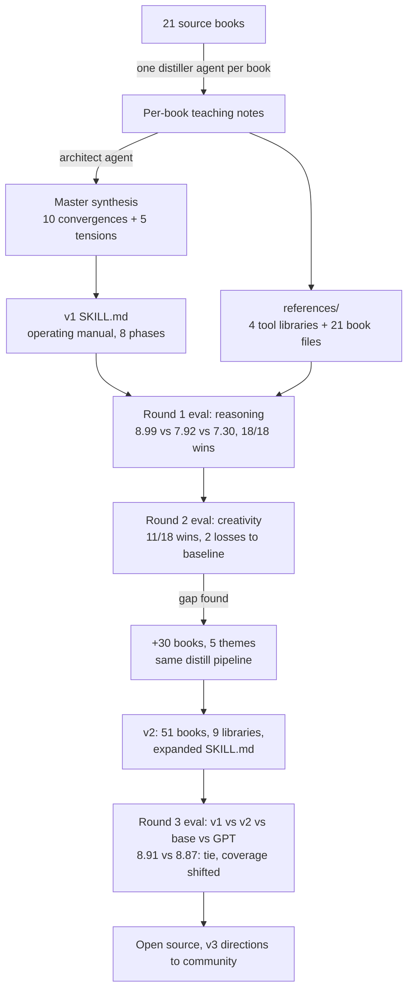

# How this skill was built

The pipeline, end to end, with the design decisions and the reasons for
them. Everything here is reproducible from the scripts in
[`evals/harness/`](../evals/harness/) plus any agent harness that can run
parallel subagents (we used Claude Code).

## Overview

## Stage 1: Corpus and per-book distillation

Each book was distilled by a dedicated agent into a teaching file: the
book's working tools restated as directives an agent can execute, with the
named frameworks, numbers, and tests preserved (Kahneman's two conditions
for trusting intuition, Tetlock's Fermi-ize move, Meadows' twelve leverage
points, Huff's five questions).

Two rules governed distillation:

- **Tools over summaries.** A chapter recap is useless in context. The file
  asks: what would this author have an agent do differently on the next
  problem?
- **Original prose only.** The teaching files are written from scratch.
  No reproduced passages; quotation is limited to short attributed phrases.
  Raw source text never enters the repo (it is gitignored by pattern).

## Stage 2: The master synthesis

A single architect pass read all distillations and produced
[`master-synthesis.md`](master-synthesis.md), the blueprint for everything
that followed. Its two key artifacts:

1. **The canon: 10 points of convergence.** Where independent authors (a
   psychologist, a physicist, a poker champion, a statistician) arrive at
   the same move, that move is load-bearing. Example: base rate first, then
   adjust appears in Tetlock, Silver, Kahneman, Bazerman, and Rosling.
2. **The tensions: 5 places the books disagree**, each resolved by scoping
   rather than by picking a winner. Trust intuition (Hamming) or distrust
   it (Kahneman)? Resolution: diagnose the domain's regularity and feedback
   first. These became the "When the directives collide" section of
   SKILL.md, which we believe is the most original part of the design: a
   skill that only lists rules invites the agent to follow them off a
   cliff; a skill that names its own conflicts and gives scoping rules
   teaches judgment.

## Stage 3: Writing SKILL.md

The operating manual follows a structure borrowed from a sibling design
skill and tuned for reasoning work:

- **Eight phases** that mirror how a hard problem actually unfolds: frame,
  check yourself, argue cleanly, quantify, stress-test, think in systems,
  generate alternatives, decide.
- **Imperative directives** with the key term bolded, one tool per bullet.
- **A NEVER list** of named failure modes (resulting, anchoring, the
  conjunction fallacy, survivorship bias). Negative constraints turned out
  to be cheap and effective: judges repeatedly rewarded responses for
  avoiding exactly these traps by name.
- **Collision rules** for directive conflicts.
- **Progressive disclosure.** SKILL.md is always in context when the skill
  fires; the 9 reference libraries and 51 book files load on demand only
  when the task needs that depth. This keeps the per-invocation token cost
  near the manual's size, and the eval data (see
  [HYPOTHESES.md](HYPOTHESES.md), H4) says the manual does most of the work.

## Stage 4: Evaluation

Built as a three-arm (later four-arm) blind tournament. The full protocol,
all scores, and the honest limitations live in [EVALS.md](EVALS.md); the
mechanics live in [`evals/README.md`](../evals/README.md). Design choices
worth naming:

- **An external yardstick.** GPT-5.5 at xhigh reasoning effort ran every
  problem as a third arm, so the skill is measured against a frontier
  competitor rather than only against its own baseline.
- **Balanced blind rotation.** Each arm occupies each anonymous slot an
  equal number of times per round, so judges cannot learn a position habit.
- **Judges score dimensions, rank, pick one best, and explain.** The
  free-text reasoning fields turned out to be the most valuable output:
  they name the mechanism behind every score and they are quoted throughout
  these docs.

## Stage 5: The v2 expansion

Round 2 exposed the creative flank, and the response was a second
distillation wave: 30 books across five themes (creativity and the
cognitive science of ideas, institutional systems, Taleb's risk trilogy,
formal models and strategy, philosophy of science), five new reference
libraries, a Phase 7 rebuilt around seven generation moves, five new
collision rules, and seven new NEVER rules.

v1 was frozen first (`build_v1_snapshot.py`, preserved in
[`versions/v1/`](../versions/v1/)) so the upgrade itself could be measured.
Round 3's verdict: a tie on the mean, a shift in coverage, and a measured
dilution cost on the calibration habit. The numbers and the lesson are in
[EVALS.md](EVALS.md).

## What we would do differently

1. **Version-control the judge prompt.** Rounds 1 to 3 specified the judge
   output contract precisely and left the prompt text in the orchestrating
   session. Convention fixed going forward.
2. **Multiple runs per cell from day one.** n=1 was enough to detect the
   large Round 1 effect and is useless for the small Round 3 one.
3. **An adversarial problem set.** Our problems were authored with known
   correct shapes. A community-contributed held-out set would be a far
   stronger test.
4. **Instrument reference loading.** We still do not know which reference
   files actually get read per task, which makes the progressive-disclosure
   claim partly an assumption.
