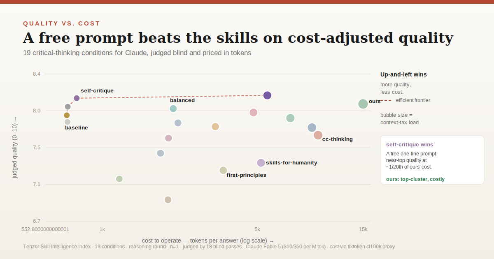
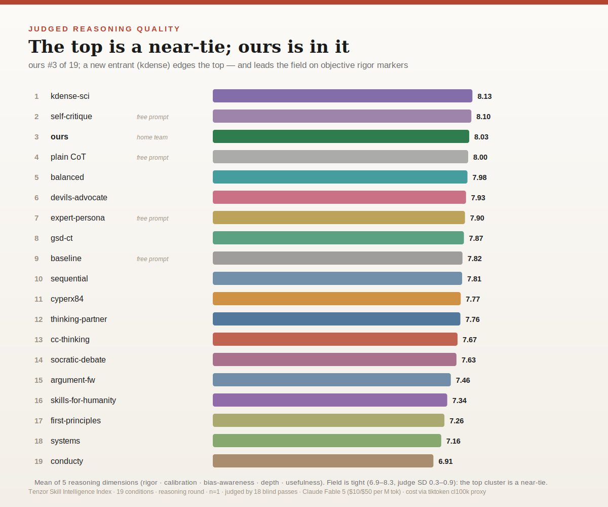
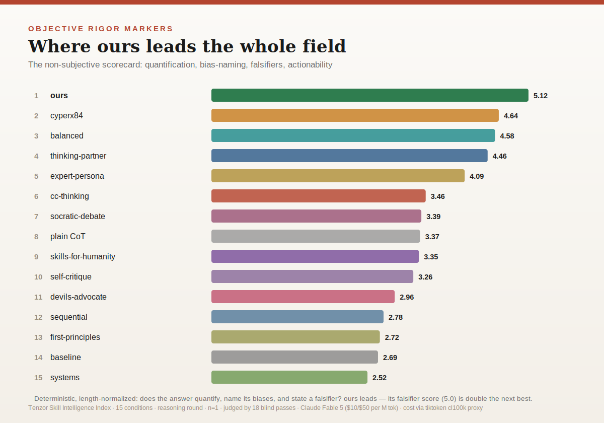

# Round 5: the Skill Intelligence Index (V2)

**The full field, priced. 15 conditions, three tracks, one honest chart.**

Rounds 1 to 3 asked a narrow question and answered it cleanly. Does this skill beat baseline Claude and GPT-5.5? Yes: first in 18/18 blind passes. Round 4 added two rival skills. Round 5 asks the hard version of the question and prices the answer:

> Against every credible public critical-thinking skill for Claude, and the cheap prompt techniques anyone can type for free, with the token cost of each one counted, how good is this skill really?

We widened the field to **15 conditions** (9 installable skills, 5 prompt/reference arms, and a no-skill baseline), generated every answer at equal length so cost is comparable, judged them all blind, and measured the token cost of each. The result is humbling in exactly the way the skill is built to be honest about. We publish it because a skill about calibration that hid its own benchmark would be a contradiction.

## The one-paragraph result

On judged reasoning quality, a free one-line `self-critique` prompt ("answer, critique yourself, revise") tops the field at 8.28, the featherweight `balanced` skill is second at 7.98, and this skill is third at 7.84. That top group is a statistical near-tie (the whole field spans 6.9 to 8.3 with judge SD of 0.3 to 0.9). Where this skill clearly leads is **objective rigor**: it is #1 on the deterministic markers (quantification, bias-naming, falsifiers), and its falsifier score of 5.0 is double the next best. It is also **the most expensive condition in the field**: its roughly 14k-token context load makes each answer cost about 20 times the self-critique prompt that out-scores it, so it is dominated on the quality-vs-cost frontier. The honest reading is that the skill produces the most rigorous, best-calibrated *form* of answer, while elaborate scaffolding buys little judged-quality gain over a simple self-critique pass and costs far more to load.

## The three tracks

### 1. Judged reasoning quality (18 blind passes, mean of 5 dimensions)

| # | Condition | Quality | Note |
|---|-----------|:---:|------|
| 1 | self-critique | **8.28** | free 1-line prompt |
| 2 | balanced | 7.98 | single-file skill |
| 3 | **ours (critical-thinking)** | **7.84** | top cluster |
| 4 | plain chain-of-thought | 7.82 | free prompt |
| 5 | devils-advocate | 7.80 | |
| 6 | sequential-thinking | 7.76 | |
| 7 | thinking-partner | 7.74 | 150+ models |
| 8 | cyperx84 mental-models | 7.61 | 98 models |
| 9 | expert-persona | 7.60 | free 1-line prompt |
| 10 | baseline (no skill) | 7.57 | |
| 11 | cc-thinking | 7.34 | 39-framework router |
| 12 | socratic-debate | 7.22 | |
| 13 | skills-for-humanity | 7.20 | 70+ skills |
| 14 | systems-thinking | 7.13 | |
| 15 | first-principles | 6.89 | |

Scored by 18 blind independent-scoring passes (6 problems by 3 judges), each rating all 15 answers 0 to 10 on rigor, calibration, bias-awareness, depth, and usefulness, with no knowledge of which condition produced which answer.

### 2. Objective rigor markers, where this skill leads

A deterministic, length-normalized scorecard (regex and lexicon, no LLM judge): does the answer give explicit probabilities, name the cognitive biases in play, and state a falsifier? This skill is #1 at 5.12, and its falsifier presence (5.0 against 2.5 or less for everything else) is the durable, length-independent edge. It is the one condition that reliably says what would change its mind.

### 3. Cost, the context tax

Every condition wrote a roughly 370-word answer, so output cost is near-constant. The entire cost difference is the **context tax**: the tokens a skill loads before it answers.

| Condition | Load (tokens) | Operate / answer | $ / answer | Judged quality |
|-----------|:---:|:---:|:---:|:---:|
| ours | 14,274 | 14,970 | $0.193 | 7.84 |
| thinking-partner | 8,104 | 8,808 | $0.109 | 7.74 |
| cc-thinking | 8,681 | 9,384 | $0.136 | 7.34 |
| balanced | 1,361 | 2,087 | $0.041 | 7.98 |
| self-critique | 0 | 766 | $0.044 | 8.28 |
| baseline | 0 | 696 | $0.044 | 7.57 |

Full 15-row tables and a USD-vs-tokens frontier are in [INDEX_EXPANDED.html](INDEX_EXPANDED.html). Pricing: Claude Fable 5, $10/$50 per M input/output tokens. With prompt-caching the load amortizes, and ours' $0.193 drops to about $0.065/answer on repeated use.

## What we changed because of this

The data is an instruction set for V2 of the skill:

1. **Trim the context tax.** A 14k-token load is the heaviest in the field and is not buying proportional judged-quality gains. Move more into progressive disclosure so the entry cost drops.
2. **Keep the falsifier discipline.** It is the skill's one durable, measured edge. Protect it.
3. **Fold in a self-critique pass.** The cheapest thing on the board is also the best, so a built-in "draft, critique, revise" loop is the highest-return change available.
4. **Stop equating more frameworks with more quality.** cc-thinking (#11) and first-principles (#15) carry large framework trees and score below a one-line prompt. Breadth is not the lever.

## Honest limitations

- **n = 1** per cell, **reasoning round only.** The creativity round and multi-run error bars are future work.
- **The top cluster is a near-tie.** Treat gaps under about 0.4 as noise. Read "self-critique above ours" as "ours does not dominate", not as "self-critique is reliably better."
- **Single judge-model family.** A cross-model judge panel on an earlier, looser benchmark split on the winner, so same-family judge bias cannot be ruled out.
- **Cost is a tiktoken cl100k proxy** (about 10 to 15% off the true Claude tokenizer), and "realistic load" estimates how many sub-files each skill reads.
- **Competitor wiring is a judgment call.** If you maintain one of these skills and think it was represented sub-optimally, open a PR with a better arm configuration and the numbers will move.

## Reproduce

All raw answers, judge JSON, the rotation keymap, the token measurements, and the build scripts are in this folder (`data/`, `harness/`). Regenerate the scorecards with the scripts in `harness/`; rebuild the dashboard with `build_expanded_dashboard.js`.
